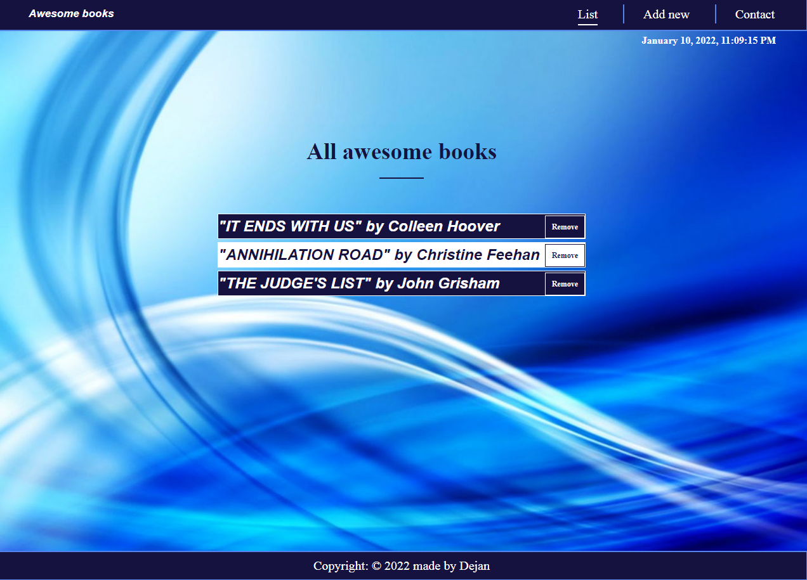

# Awesome Books

Live preview [here](https://vudej.github.io/Awesome-Books-ES6/). 

## Screenshots

## Contents
* [Navbar](#navbar)
* [Book List](#book-list)
* [Add Book](#add-book)
* [Contact](#contact)

## General info
Awesome Books is single-page, where you can add books to list and delete books from list.
Local storage save items and with remove books, they disappear from UI and local storage.
Installed luxon for time.

	
## Technologies
Project is created with:
* HTML
* CSS
* Javascript

## Setup
To run this project, install it locally using:
$ cd Desktop
$ git clone https://github.com/VuDej/Awesome-Books-ES6

## Author

👤 **Dejan Vujovic**

- Github : [@VuDej](https://github.com/VuDej)
- Twitter: [@DejanVuj](https://twitter.com/DejanVuj)
- LinkdIn : [@Dejan-Vujovic](https://www.linkedin.com/in/dejan-vujovic-5a0672225/)

## 🤝 Contributing

Contributions, issues, and feature requests are welcome!

Feel free to check the [issues page](https://github.com/VuDej/Awesome-Books-ES6/issues/2).

## Show your support

Give a ⭐️ if you like this project!

## 📝 License

This project is [MIT](LICENSE) licensed.​

## Contact
Created by [@VuDej](https://github.com/VuDej) - feel free to contact me!

